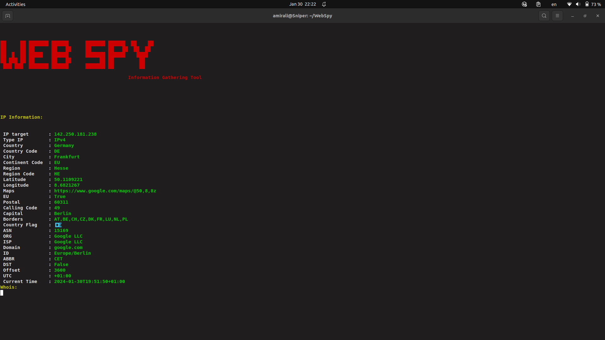
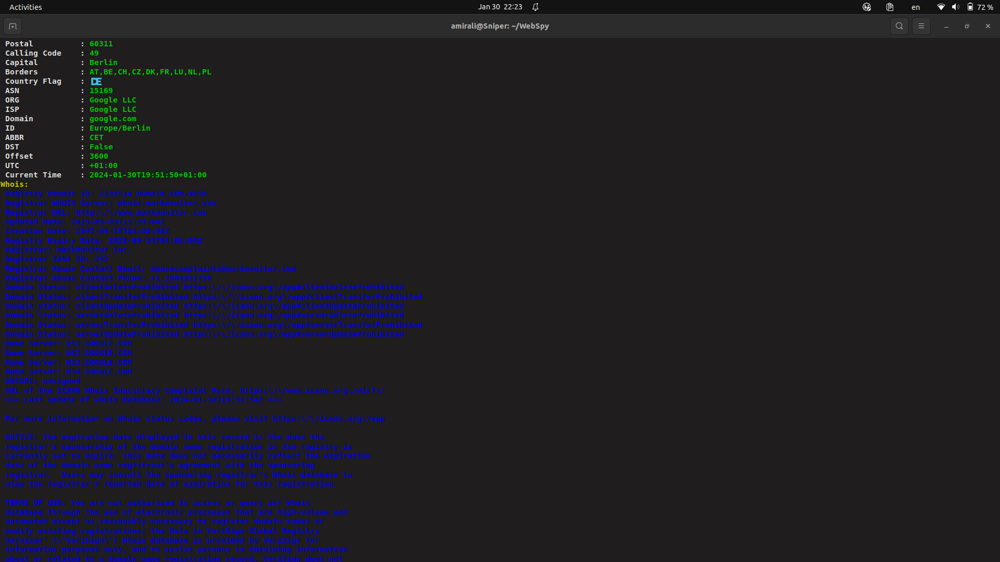
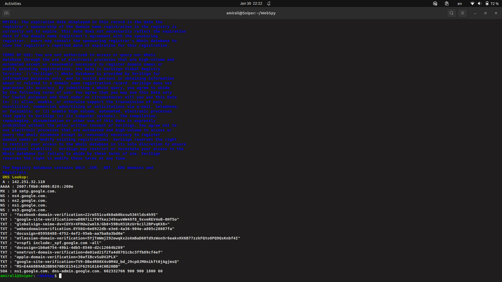

# WebSpy
Information gathering  tool

# installation
`git clone https://github.com/amirali115a/WebSpy `

`cd WebSpy`

`bash ./install`

# Usage
`./WebSpy --help `

`./WebSpy -u <your website>`

` ./WebSpy -u google.com  `

